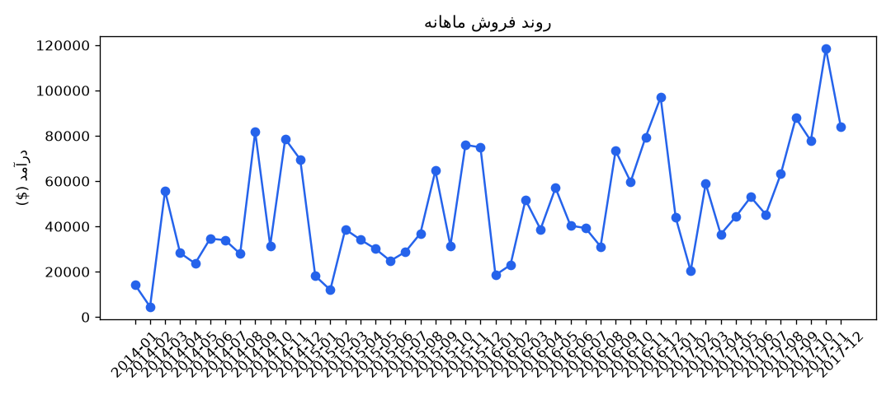
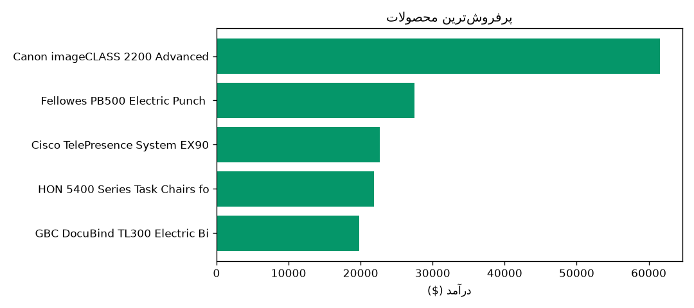

# 🥉 AI Business Analyst

Automating business data analysis by combining SQL, Pandas, and AI —
a system that reads raw sales data, analyzes it, and generates clear,
decision-ready reports for managers.

## 🎯 Problem

Manually analyzing sales data is time-consuming and usually requires a data
specialist to turn raw numbers into an actionable decision. This project
closes that gap by combining structured analysis (Pandas) with intelligent
interpretation (LLM).

## 🏗️ Architecture

```
SQL Database → Pandas Analysis → AI Insight Generation → Automated HTML Report
```

The project is split into two layers:

- **`src/`** — core logic (a library independent of how it's run)
- **entry points** (`main.py`, `automation.py`) — thin execution layers with
  no business logic of their own

This separation makes it easy to add new interfaces later (e.g. an API or a
dashboard) without touching the core logic.

## ✨ Features

- Extracts and analyzes data with SQL + Pandas (sales trends, anomalies,
  KPIs, regional performance)
- Generates business insights and recommendations with GPT, based on
  pre-aggregated summaries rather than raw data
- Produces an automated HTML report with charts
- Supports scheduled execution (Automation) via the `schedule` library
- Handles errors gracefully (missing API key, empty database, connection
  failures) instead of crashing

## 📸 Sample Output





## 🛠️ Tech Stack

Python · Pandas · SQLite · OpenAI API · Matplotlib · schedule

## 🚀 Getting Started

```bash
git clone <repo-url>
cd ai-business-analyst
python -m venv venv
source venv/bin/activate  # Windows: venv\Scripts\activate
pip install -r requirements.txt
```

Download the [Superstore Sales dataset](https://www.kaggle.com/datasets/vivek468/superstore-dataset-final)
and place it next to the project, then:

```bash
python src/db.py          # Load the CSV into the database
cp .env.example .env      # Add your OpenAI API key
python main.py            # Run the pipeline once
python automation.py      # Or run it on a daily schedule
```

## 📂 Project Structure

```
ai-business-analyst/
├── data/                  # SQLite database
├── src/
│   ├── db.py              # Data loading and DB connection
│   ├── analysis.py        # Pandas analysis (KPIs, trends, anomalies)
│   ├── ai_insights.py     # Prompt building and OpenAI integration
│   ├── report.py          # Chart generation and HTML report building
│   └── pipeline.py        # Orchestrates the full analysis flow
├── reports/                # Generated reports
├── assets/                 # Screenshots for documentation
├── main.py                 # One-off pipeline execution
├── automation.py           # Scheduled execution
└── requirements.txt
```

## 💡 Challenges & Design Decisions

- **Challenge:** Feeding raw data directly to an LLM is expensive and imprecise.
  **Solution:** Data is aggregated into KPIs and summaries with Pandas before
  being sent to the AI, which focuses purely on interpretation rather than
  computation.

- **Challenge:** Keeping analysis logic decoupled from how it's executed.
  **Solution:** `src/pipeline.py` acts as the single source of truth for the
  logic, while `main.py` and `automation.py` remain thin entry points.

- **Challenge:** Staying resilient to AI connection failures or missing data.
  **Solution:** Prerequisite checks (`check_prerequisites`) and layered error
  handling prevent a full crash — the pipeline degrades gracefully instead.

## 📄 License

MIT

---

## 🇮🇷 توضیح مختصر (فارسی)

این پروژه یک سیستم خودکار تحلیل داده کسب‌وکار است که داده فروش را از یک
دیتابیس SQL می‌خواند، با Pandas تحلیل می‌کند (روند فروش، محصولات پرفروش،
ناهنجاری‌ها)، و با استفاده از مدل زبانی OpenAI یک گزارش تحلیلی قابل‌فهم برای
مدیران تولید می‌کند. خروجی نهایی یک فایل HTML همراه با نمودار است که می‌تواند
به‌صورت خودکار و زمان‌بندی‌شده (روزانه) نیز اجرا شود.

**هدف پروژه:** نمایش توانایی ترکیب SQL، Pandas و هوش مصنوعی برای ساخت یک
ابزار تحلیل داده واقعی و کاربردی — نه فقط یک اسکریپت آموزشی.

نحوه اجرا و جزئیات فنی در بخش‌های بالا (به انگلیسی) توضیح داده شده است.